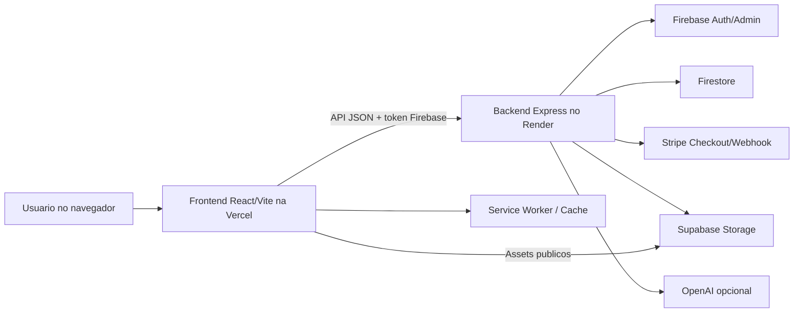
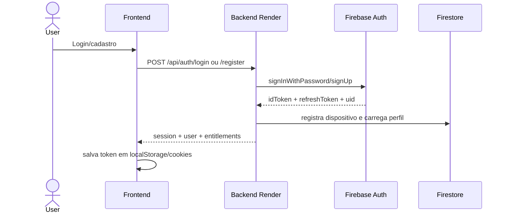
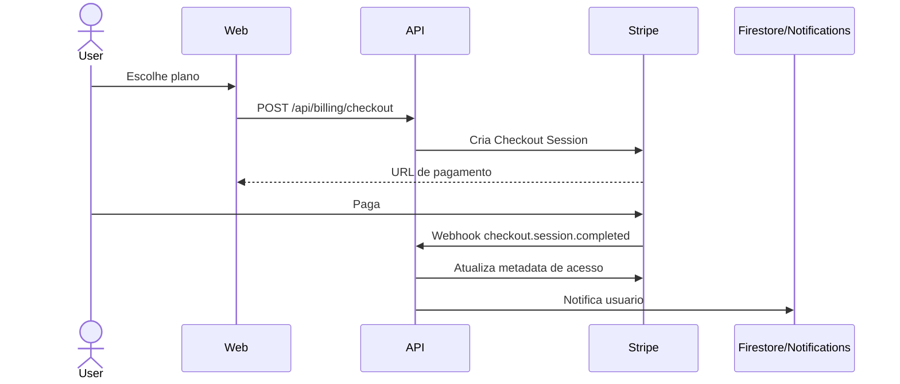
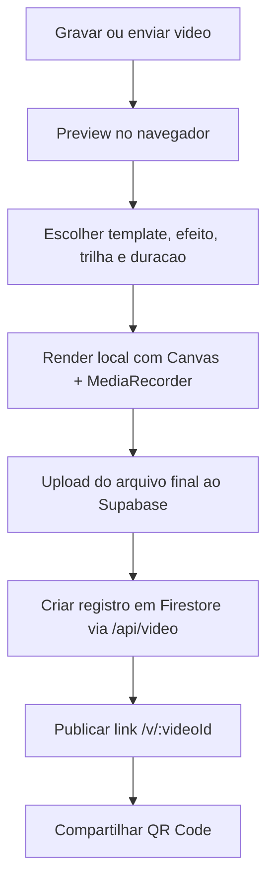
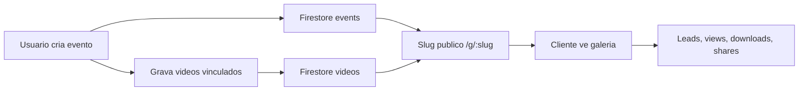
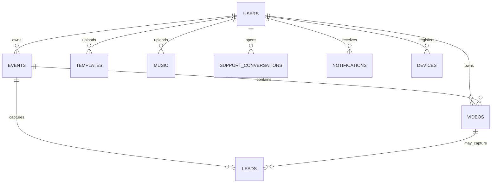

# Blueprint Tecnico

## Visao tecnica

SIX3° e um monorepo com frontend React/Vite e backend Express. O frontend e responsavel pela interface, edicao local de video e chamadas autenticadas. O backend centraliza autenticacao com Firebase, regras de permissao, Stripe, Firestore, Supabase Storage, suporte, notificacoes, eventos, videos e templates.

## Arquitetura em alto nivel

## Componentes principais

| Camada | Arquivo/Pasta | Responsabilidade |
|---|---|---|
| Rotas React | `apps/web/src/App.tsx` | Define rotas publicas, privadas, pagas e admin |
| Layout app | `apps/web/src/components/layout` | Sidebar, header, bottom nav mobile |
| Auth client | `apps/web/src/services/authService.ts` | Sessao, cookies locais, refresh, device headers |
| Editor local | `apps/web/src/services/browserVideoRenderer.ts` | Canvas, MediaRecorder, efeitos, overlays e audio |
| API Express | `apps/server/src/index.ts` | CORS, Helmet, rate limit, rotas |
| Auth server | `apps/server/src/routes/auth.ts` | Login, cadastro, perfil, dispositivos, senha, roles |
| Billing | `apps/server/src/routes/billing.ts` | Checkout, webhook e clientes ativos |
| Videos | `apps/server/src/routes/video.ts` | CRUD, stats, process opcional |
| Templates | `apps/server/src/routes/templates.ts` | Catalogo, seed, custom templates e musicas |
| Upload | `apps/server/src/routes/upload.ts` | Upload para Supabase |
| Eventos | `apps/server/src/routes/events.ts` | CRUD de eventos e galerias |
| Suporte | `apps/server/src/routes/support.ts` | Conversas usuario/admin/anonimo |
| Notificacoes | `apps/server/src/routes/notifications.ts` | Lista, preferencias, leitura, broadcast |

## Fluxo de autenticacao

## Fluxo de pagamento

## Fluxo de video

## Fluxo de eventos e galerias

## Modelo de dados principal

## Principais colecoes Firestore

| Colecao | Uso |
|---|---|
| `users` | Perfil, preferencias, notificationPreferences |
| `users/{uid}/devices` | Dispositivos conectados, IP, localizacao, revokedAt |
| `events` | Eventos, pagina publica, branding e lead capture |
| `videos` | Videos, status, storagePath, stats, efeito e template |
| `templates` | Templates customizados |
| `music` | Musicas customizadas |
| `supportConversations` | Conversas de suporte |
| `supportConversations/{id}/messages` | Mensagens |
| `notifications` | Notificacoes in-app |
| `passwordRecoveryChallenges` | Desafios temporarios de recuperacao |

## Buckets Supabase

| Bucket | Uso | Status |
|---|---|---|
| `videos` | Videos brutos e finais | Existente |
| `templates` | Assets legados e imagens de evento | Existente |
| `six3-project-templates` | Templates oficiais gerados/animados | Planejado/existente via seed |
| `six3-project-music` | Musicas oficiais geradas/publicas | Planejado/existente via seed |
| `six3-user-templates` | Templates enviados pelo usuario | Existente via seed/uso |
| `six3-user-music` | Musicas enviadas pelo usuario | Existente via seed/uso |

## Regras de permissao

- `PrivateRoute`: exige usuario logado.
- `PaidRoute`: exige assinatura ativa.
- `AdminRoute`: exige role admin.
- Backend valida token em `getAuthenticatedUser`.
- Backend valida plano em `requireActiveSubscription` e `requirePlanFeature`.
- Admin e definido por variaveis `ADMIN_UID` e/ou `ADMIN_EMAIL`, nao por hardcode.

## Endpoints principais

| Grupo | Rotas |
|---|---|
| Auth | `/api/auth/register`, `/login`, `/me`, `/profile`, `/password`, `/devices`, `/recovery/*` |
| Billing | `/api/billing/checkout`, `/api/billing/webhook`, `/api/billing/admin/customers` |
| Upload | `/api/upload/video`, `/image`, `/template`, `/music` |
| Video | `/api/video`, `/api/video/process`, `/api/video/effects`, `/api/video/:id/stats` |
| Templates | `/api/templates/generated`, `/custom`, `/generated-music`, `/seed-assets` |
| Eventos | `/api/events`, `/api/events/:id`, `/api/events/slug/:slug` |
| Leads | `/api/leads` |
| Suporte | `/api/support/conversations`, `/anonymous/conversations`, `/admin/conversations` |
| Notificacoes | `/api/notifications`, `/preferences`, `/admin/broadcast` |

## Segurança tecnica

| Controle | Status |
|---|---|
| Secrets fora do client | Existente por arquitetura |
| CORS restrito a Vercel/local/previews | Existente |
| Helmet | Existente |
| Rate limit global | Existente |
| Validacao Zod | Existente |
| Device registry | Existente |
| Recuperacao sem revelar dados | Existente |
| Admin por env | Existente |
| Upload com tipo e tamanho limitados | Existente |
| URLs de midia processadas restritas ao Supabase | Existente |

## Pontos tecnicos de atencao

1. Criar fila de jobs se o processamento server-side voltar a ser habilitado.
2. Migrar pagamento para assinatura recorrente Stripe Billing se a renovacao mensal precisar ser automatica real.
3. Revisar regras Firestore/Supabase antes de escala.
4. Adicionar testes automatizados para auth, billing, upload e editor.
5. Corrigir textos com encoding quebrado.
6. Consolidar logging e monitoramento.
