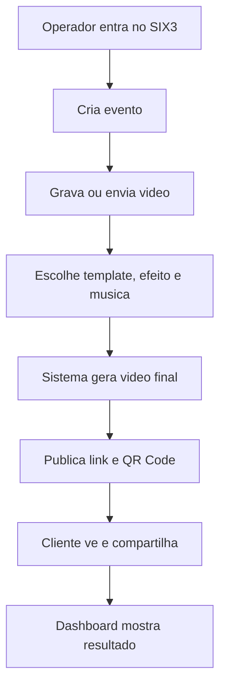

# Explicacao Popular

## O que e o SIX3°

SIX3° e como um painel online para quem trabalha com videos 360 em festas, casamentos, eventos corporativos e ativacoes.

Em vez de gravar o video, editar em outro programa, salvar no computador, mandar por WhatsApp e tentar organizar tudo manualmente, o operador faz tudo dentro de uma plataforma.

## Como funciona em palavras simples

1. A pessoa cria uma conta.
2. Escolhe um plano.
3. Cria um evento ou grava um video avulso.
4. Grava pela camera ou envia um video.
5. Escolhe um visual por cima do video, como uma moldura transparente.
6. Escolhe efeito, musica e duracao.
7. O sistema monta o video final no navegador.
8. O video e publicado com um link.
9. O operador compartilha um QR Code com o cliente.
10. O cliente acessa o video e pode compartilhar.

## Exemplo real

Imagine uma festa de aniversario.

O operador chega com a plataforma 360. Durante a festa, ele grava videos das pessoas. Cada video pode receber um template de aniversario, uma trilha animada, um efeito de movimento e um link final. Depois, o cliente recebe uma pagina com os videos e um QR Code para compartilhar.

## O que o usuario ganha

- Menos trabalho manual.
- Entrega mais bonita.
- Mais rapidez para publicar.
- Mais organizacao por evento.
- Mais chances de vender uma experiencia premium.
- Dados basicos sobre visualizacoes, downloads e compartilhamentos.
- Captura de contatos quando o evento precisa gerar leads.

## O que o cliente final ganha

- Acesso facil ao video.
- Link simples para compartilhar.
- QR Code.
- Experiencia com cara de marca/evento.
- Galeria organizada.

## O que o admin ganha

- Visao de clientes.
- Suporte centralizado.
- Controle de planos e acesso.
- Capacidade de responder conversas.
- Acesso ilimitado para operacao interna.

## O que ja existe hoje

- Conta, login e recuperacao de senha.
- Planos e checkout.
- Bloqueio de recursos por plano.
- Dashboard com dados reais.
- Criacao de eventos.
- Gravacao e upload de video.
- Editor com template, efeito, trilha, duracao e timeline.
- Publicacao com link e QR Code.
- Pagina publica de video/galeria.
- Templates e musicas.
- Suporte por mensagens.
- Notificacoes.
- Configuracoes com tema, senha e dispositivos.

## O que ainda precisa melhorar

- Deixar o fluxo principal mais simples e sem pontos de duvida.
- Melhorar ainda mais templates com qualidade visual profissional.
- Garantir que o pagamento mensal renove automaticamente de forma robusta.
- Melhorar testes e monitoramento.
- Evitar processamento pesado no Render.
- Polir mobile para ser excelente em campo.

## Explicacao visual simples

## Por que isso pode vender

Porque quem trabalha com evento quer entregar rapido, bonito e com pouca complicacao. O produto junta varias coisas que normalmente ficam espalhadas: edicao, templates, galeria, QR Code, leads, suporte e painel.

## Frase popular do produto

SIX3° e uma central para transformar videos 360 em entregas profissionais, prontas para compartilhar com cliente em poucos cliques.
