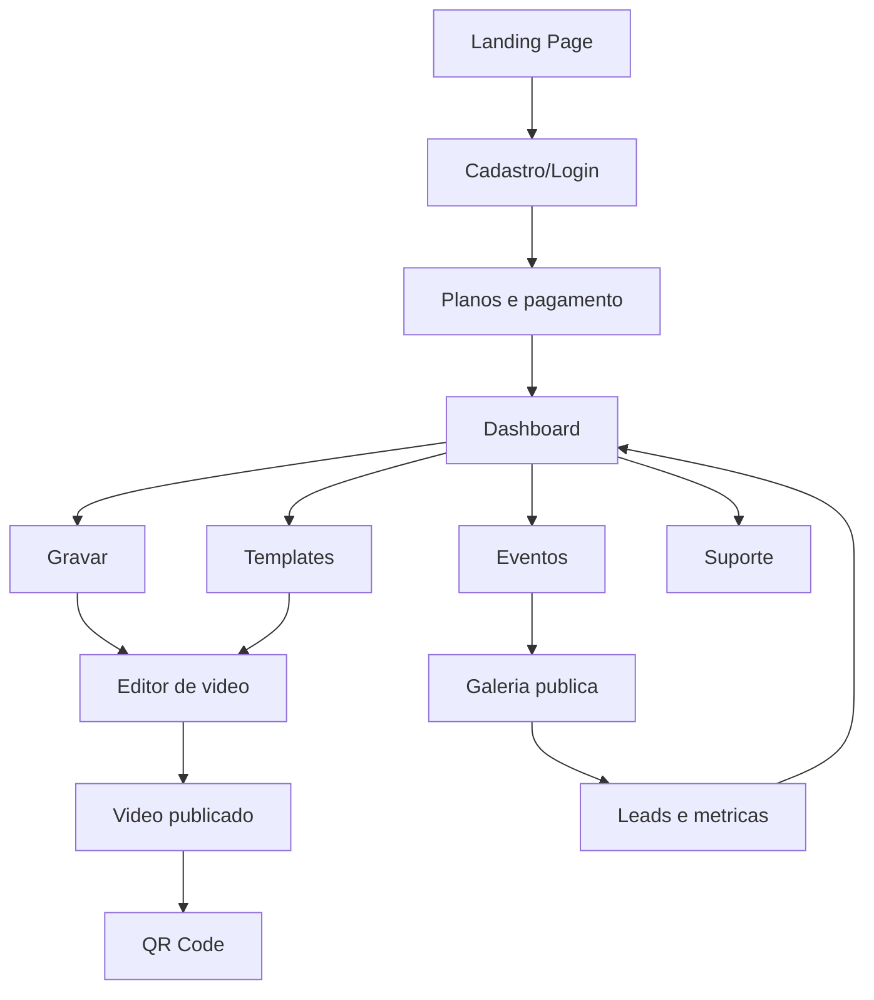
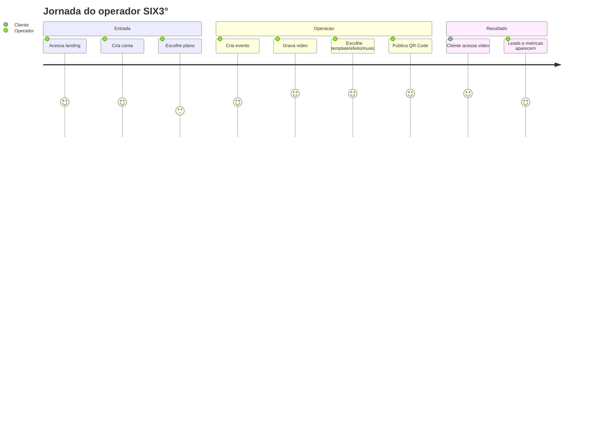
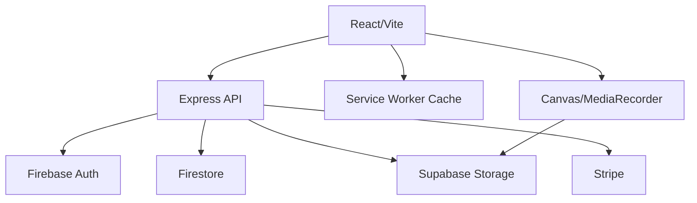
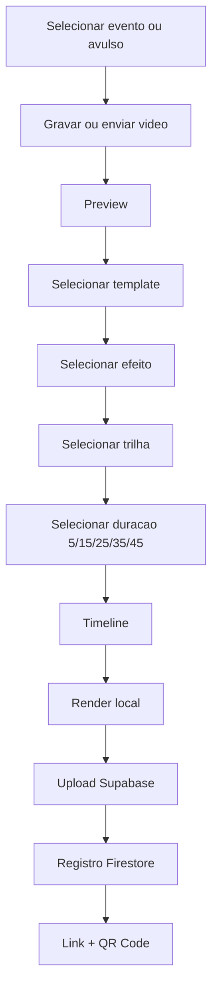
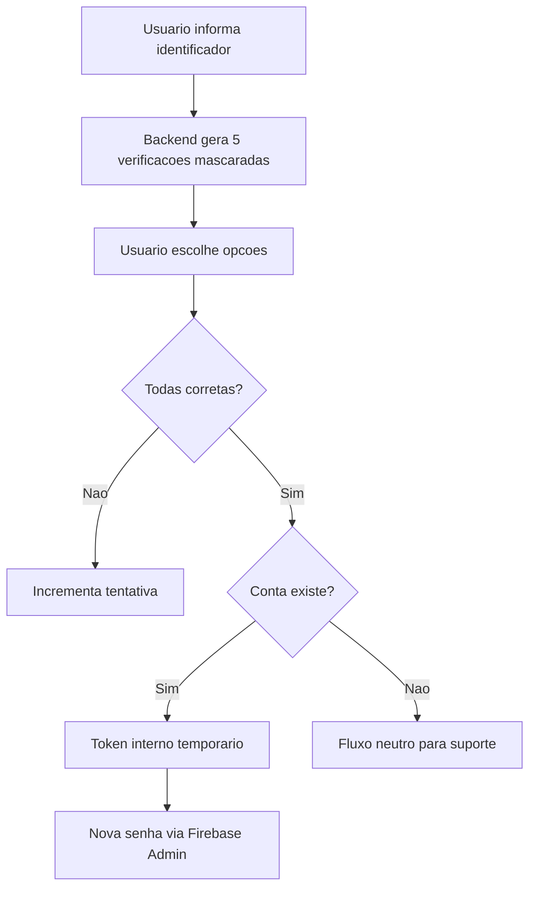
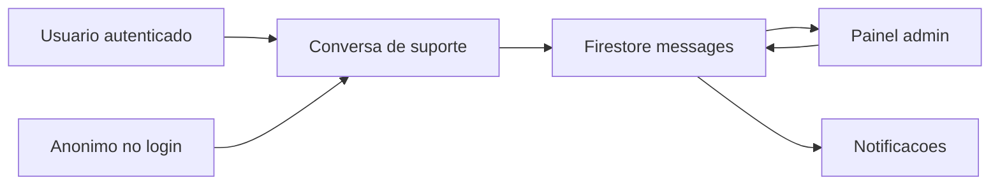
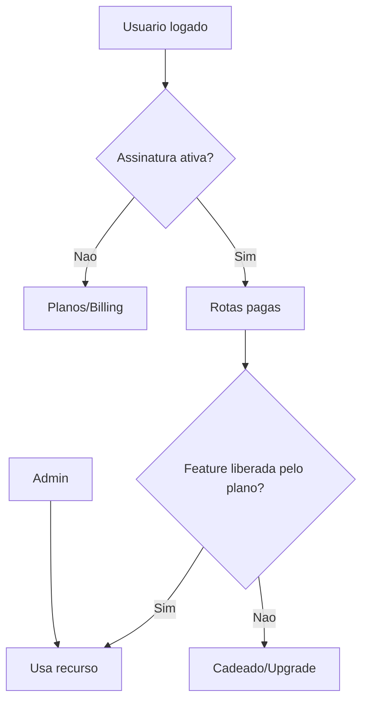
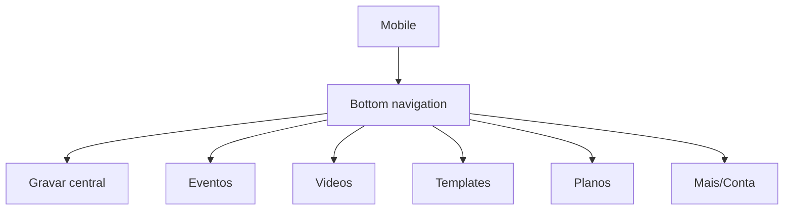
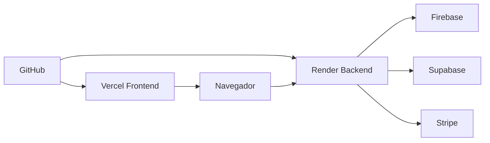

# Mapa Visual Ilustrado

## Mapa geral do produto



## Jornada do operador



## Mapa das telas

```mermaid
flowchart LR
  subgraph Publico
    Home[/]
    Plans[/plans]
    Login[/login]
    Register[/register]
    Forgot[/forgot-password]
    Gallery[/g/:slug]
    Video[/v/:id]
  end

  subgraph Aplicativo
    Dashboard[/app/dashboard]
    Events[/app/events]
    Record[/app/gravar]
    Videos[/app/videos]
    Templates[/app/templates]
    Leads[/app/leads]
    Analytics[/app/analytics]
    Billing[/app/billing]
    Settings[/app/settings]
    Support[/app/support]
    Admin[/app/admin]
  end

  Home --> Plans --> Register
  Login --> Dashboard
  Register --> Billing
  Billing --> Dashboard
  Dashboard --> Events
  Dashboard --> Record
  Record --> Video
  Events --> Gallery
```

## Fluxo de dados



## Fluxo do editor



## Fluxo de recuperacao de senha



## Fluxo de suporte



## Fluxo de planos e bloqueio



## Visao mobile



## Visao de arquitetura de deploy



## Leitura rapida do mapa

O produto funciona como uma esteira: entrada pelo plano, operacao por evento/video, edicao local, publicacao e medicao. O maior cuidado tecnico esta no video, porque processamento pesado precisa continuar local ou ir para worker dedicado.
